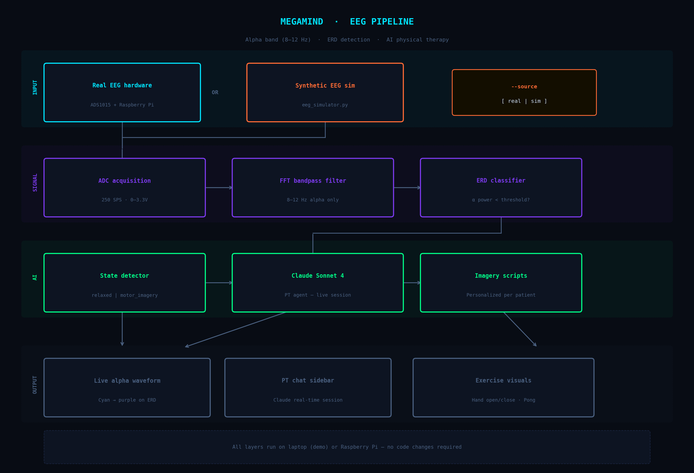

# Megamind

<pre>
⠀⣞⢽⢪⢣⢣⢣⢫⡺⡵⣝⡮⣗⢷⢽⢽⢽⣮⡷⡽⣜⣜⢮⢺⣜⢷⢽⢝⡽⣝
⠸⡸⠜⠕⠕⠁⢁⢇⢏⢽⢺⣪⡳⡝⣎⣏⢯⢞⡿⣟⣷⣳⢯⡷⣽⢽⢯⣳⣫⠇
⠀⠀⢀⢀⢄⢬⢪⡪⡎⣆⡈⠚⠜⠕⠇⠗⠝⢕⢯⢫⣞⣯⣿⣻⡽⣏⢗⣗⠏⠀
⠀⠪⡪⡪⣪⢪⢺⢸⢢⢓⢆⢤⢀⠀⠀⠀⠀⠈⢊⢞⡾⣿⡯⣏⢮⠷⠁⠀⠀
⠀⠀⠀⠈⠊⠆⡃⠕⢕⢇⢇⢇⢇⢇⢏⢎⢎⢆⢄⠀⢑⣽⣿⢝⠲⠉⠀⠀⠀⠀
⠀⠀⠀⠀⠀⡿⠂⠠⠀⡇⢇⠕⢈⣀⠀⠁⠡⠣⡣⡫⣂⣿⠯⢪⠰⠂⠀⠀⠀⠀
⠀⠀⠀⠀⡦⡙⡂⢀⢤⢣⠣⡈⣾⡃⠠⠄⠀⡄⢱⣌⣶⢏⢊⠂⠀⠀⠀⠀⠀⠀
⠀⠀⠀⠀⢝⡲⣜⡮⡏⢎⢌⢂⠙⠢⠐⢀⢘⢵⣽⣿⡿⠁⠁⠀⠀⠀⠀⠀⠀⠀
⠀⠀⠀⠀⠨⣺⡺⡕⡕⡱⡑⡆⡕⡅⡕⡜⡼⢽⡻⠏⠀⠀⠀⠀⠀⠀⠀⠀⠀⠀
⠀⠀⠀⠀⣼⣳⣫⣾⣵⣗⡵⡱⡡⢣⢑⢕⢜⢕⡝⠀⠀⠀⠀⠀⠀⠀⠀⠀⠀⠀
⠀⠀⠀⣴⣿⣾⣿⣿⣿⡿⡽⡑⢌⠪⡢⡣⣣⡟⠀⠀⠀⠀⠀⠀⠀⠀⠀⠀⠀⠀
⠀⠀⠀⡟⡾⣿⢿⢿⢵⣽⣾⣼⣘⢸⢸⣞⡟⠀⠀⠀⠀⠀⠀⠀⠀⠀⠀⠀⠀⠀
⠀⠀⠀⠀⠁⠇⠡⠩⡫⢿⣝⡻⡮⣒⢽⠋⠀⠀⠀⠀⠀⠀⠀⠀⠀⠀⠀⠀⠀⠀
</pre>

## Overview

**Megamind** is an open-source, DIY electroencephalography (EEG) device paired with an AI-powered brain-computer interface that captures neural data during physical therapy sessions for traumatic brain injury (TBI) patients. It uses personalized guided imagery scripts (generated by a large language model) to support motor function retraining through real-time neural feedback.

The system detects patterns of neural activity associated with imagined movement, then uses that signal to provide feedback and guide patients through personalized motor imagery exercises. 

---

## Why This Exists

Motor imagery therapy is a clinically validated approach to neurorehabilitation, but it's expensive, inaccessible, and often generic. Off-the-shelf EEG hardware costs *thousands of dollars*. Megamind is an attempt to: reduce expense by using low-cost hardware, use  AI-generated personalized scripts for training exercises, and provide real-time neural feedback. 

- **Reduce cost** — full BOM under $100 using off-the-shelf components

---

## The Science (plain English)
 
The circuit measures **alpha waves** — oscillations at 8–12 Hz produced by the motor cortex.
 
| State | Alpha power | What it means |
|---|---|---|
| Relaxed / eyes closed | **High** | Patient is resting |
| Imagining movement | **Low** (ERD) | Motor imagery is happening |
 
This drop in alpha power is called **ERD (Event-Related Desynchronization)**. It's the same signal used in clinical BCI research. We detect it with a simple threshold on FFT band power — and use it to trigger exercises, animate the hand, and guide the Claude PT agent.

---

## Pipeline
 

 
The pipeline has four layers:
 
**INPUT** — Real EEG hardware (`--source real`) or synthetic simulation (`--source sim`). The `--source` flag is the *only* difference between demo and production mode. All downstream processing is identical.
 
**SIGNAL** — ADC acquisition at 250 SPS → FFT bandpass filter isolating 8–12 Hz → ERD classifier (alpha power below threshold = motor imagery detected).
 
**AI** — State detector feeds into Claude Sonnet 4 acting as a physical therapist, generating personalized guided imagery scripts that adapt in real time to the patient's neural state.
 
**OUTPUT** — Live alpha waveform (cyan at rest, shifts to purple on ERD), single alpha power bar with ERD badge, animated hand exercise, neural pong, and Claude PT chat sidebar.
 
---

## Features

- **DIY EEG acquisition circuit** — instrumentation amp topology, captures microvolt-level alpha oscillations from the scalp
- **Alpha ERD detection** — FFT-based classifier on the 8–12 Hz band; detects motor imagery via alpha suppression
- **AI physical therapist** — Claude Sonnet 4 guides the session, responds to detected state changes, generates personalized imagery scripts
- **Real-time visual feedback** — hand open/close animation and neural pong respond to brain signal; closes the loop between neural activity and therapy
- **Real or simulated data** — single `--source` flag switches between live hardware and synthetic pipeline validation

---

## Hardware

The acquisition circuit is built around a standard instrumentation amplifier topology designed to capture microvolt-level biopotentials from the scalp (EEG) and body surface (ECG).

### Components Overview
<!-- TODO add full parts list, circuit design, progress images -->
| Category | Key Parts |
|---|---|
| Capacitors | 10nF, 20nF ceramic; 100nF, 220nF tantalum; 1µF, 10µF electrolytic |
| Resistors | 12Ω through 1MΩ (see BOM for full list) |
| Electrodes | Gold cup (reusable) or disposable pre-gelled for prototyping |
| Amplifier | Instrumentation amp — see circuit schematic |
| MCU | Raspberry Pi 4 (I²C host) |
| Electrodes | Gold cup (reusable) or disposable pre-gelled for prototyping |

> **Electrode note:** Gold cup electrodes give cleaner signals and are recommended for repeated sessions with the same patient. Disposable pre-gelled electrodes are fine but not as conductive.

<!-- ---

## Software -->
<!-- TODO Add softare -->

---

## Getting Started

Full setup guide coming soon. 
<!-- In the meantime:

1. **Build the circuit** — follow the schematic in `/hardware/` and source parts from the BOM
2. **Set up signal acquisition** — see `/acquisition/README.md`
3. **Run the classification pipeline** — see `/classification/README.md`
4. **Generate imagery scripts** — see `/imagery/README.md` for LLM integration
5. **Close the loop** — see `/feedback/README.md` -->

---

## Clinical Context

This project is intended as a research and development tool, not a certified medical device. It is not approved for clinical use. Always work with qualified clinicians when applying this system in a therapeutic setting.

Motor imagery therapy has a substantial evidence base in TBI and stroke rehabilitation. Key concepts underpinning this system:

- **Motor imagery** — mentally rehearsing a movement without physically performing it activates many of the same neural pathways as actual movement
- **Event-related desynchronization (ERD)** — a measurable decrease in EEG signal power in the mu (8–12 Hz) and beta (13–30 Hz) bands that occurs during both real and imagined movement
- **Personalized imagery** — imagery grounded in a patient's own memories and meaningful activities produces stronger, more consistent neural responses

---

## References

- Pfurtscheller, G., & Neuper, C. (1997). Motor imagery activates primary sensorimotor area in humans. *Neuroscience Letters.*
- Ang, K. K., et al. (2011). A clinical study of motor imagery-based brain-computer interface for upper limb robotic rehabilitation. *EMBC.*

---

## License

MIT — because knowledge, like a giant blue head, should be shared freely.
