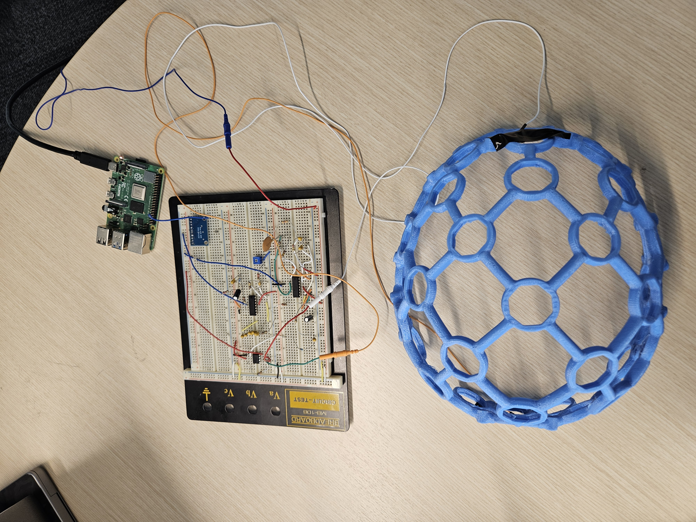
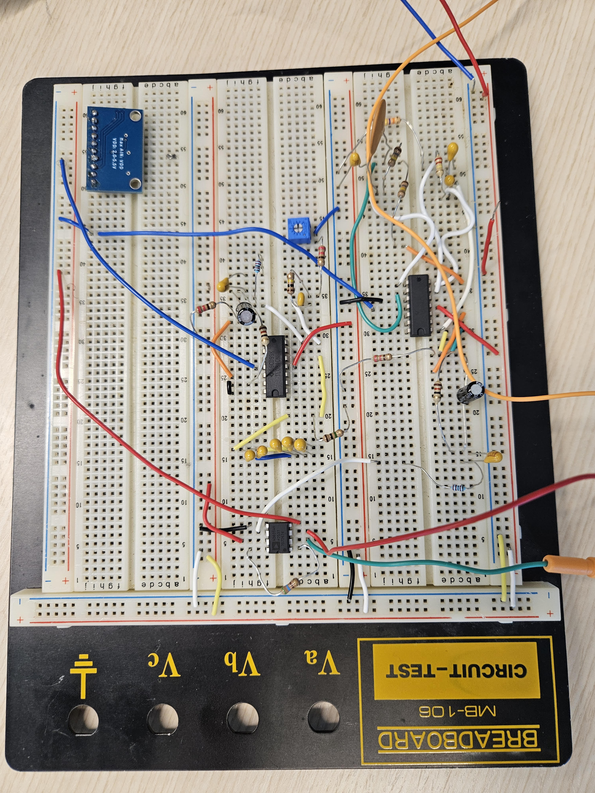
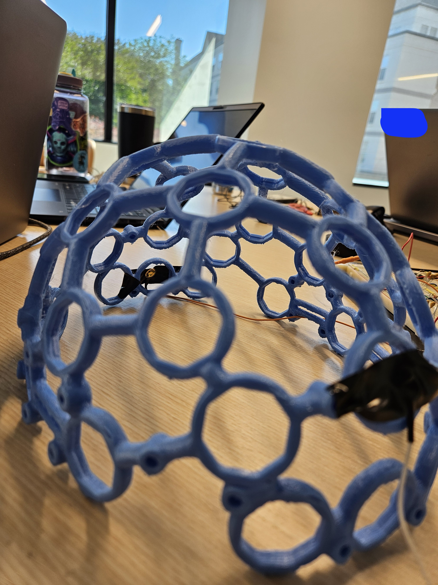

# Megamind
<div align="center">
<pre>
⠀⣞⢽⢪⢣⢣⢣⢫⡺⡵⣝⡮⣗⢷⢽⢽⢽⣮⡷⡽⣜⣜⢮⢺⣜⢷⢽⢝⡽⣝
⠸⡸⠜⠕⠕⠁⢁⢇⢏⢽⢺⣪⡳⡝⣎⣏⢯⢞⡿⣟⣷⣳⢯⡷⣽⢽⢯⣳⣫⠇
⠀⠀⢀⢀⢄⢬⢪⡪⡎⣆⡈⠚⠜⠕⠇⠗⠝⢕⢯⢫⣞⣯⣿⣻⡽⣏⢗⣗⠏⠀
⠀⠪⡪⡪⣪⢪⢺⢸⢢⢓⢆⢤⢀⠀⠀⠀⠀⠈⢊⢞⡾⣿⡯⣏⢮⠷⠁⠀⠀
⠀⠀⠀⠈⠊⠆⡃⠕⢕⢇⢇⢇⢇⢇⢏⢎⢎⢆⢄⠀⢑⣽⣿⢝⠲⠉⠀⠀⠀⠀
⠀⠀⠀⠀⠀⡿⠂⠠⠀⡇⢇⠕⢈⣀⠀⠁⠡⠣⡣⡫⣂⣿⠯⢪⠰⠂⠀⠀⠀⠀
⠀⠀⠀⠀⡦⡙⡂⢀⢤⢣⠣⡈⣾⡃⠠⠄⠀⡄⢱⣌⣶⢏⢊⠂⠀⠀⠀⠀⠀⠀
⠀⠀⠀⠀⢝⡲⣜⡮⡏⢎⢌⢂⠙⠢⠐⢀⢘⢵⣽⣿⡿⠁⠁⠀⠀⠀⠀⠀⠀⠀
⠀⠀⠀⠀⠨⣺⡺⡕⡕⡱⡑⡆⡕⡅⡕⡜⡼⢽⡻⠏⠀⠀⠀⠀⠀⠀⠀⠀⠀⠀
⠀⠀⠀⠀⣼⣳⣫⣾⣵⣗⡵⡱⡡⢣⢑⢕⢜⢕⡝⠀⠀⠀⠀⠀⠀⠀⠀⠀⠀⠀
⠀⠀⠀⣴⣿⣾⣿⣿⣿⡿⡽⡑⢌⠪⡢⡣⣣⡟⠀⠀⠀⠀⠀⠀⠀⠀⠀⠀⠀⠀
⠀⠀⠀⡟⡾⣿⢿⢿⢵⣽⣾⣼⣘⢸⢸⣞⡟⠀⠀⠀⠀⠀⠀⠀⠀⠀⠀⠀⠀⠀
⠀⠀⠀⠀⠁⠇⠡⠩⡫⢿⣝⡻⡮⣒⢽⠋⠀⠀⠀⠀⠀⠀⠀⠀⠀⠀⠀⠀⠀⠀
</pre>

**A ~$100 DIY EEG + AI physical therapist for traumatic brain injury motor rehabilitation.**

</div>

---

## Overview

**Megamind** is an open-source, DIY electroencephalography (EEG) device paired with an AI-powered brain-computer interface for traumatic brain injury (TBI) rehabilitation. It captures alpha brainwave data during physical therapy sessions and uses it to drive real-time motor imagery exercises, with an AI physical therapist (powered by Gemini) providing live commentary to the attending physician.

The system measures alpha power (8–12 Hz) from the occipital region. When a patient imagines moving their hand, alpha power drops — this is called **ERD (Event-Related Desynchronization)**. Megamind detects that drop and uses it as the control signal: animating a hand exercise and generating physician-facing clinical observations in real time.

---

## Why This Exists

Motor imagery therapy is clinically validated for TBI and stroke rehabilitation, but it's expensive, inaccessible, and often generic. Off-the-shelf EEG hardware costs *thousands of dollars*. Megamind is an attempt to change that:

- **Reduce cost** — full BOM under $50 using off-the-shelf components
- **Close the loop** — real-time ERD feedback makes the session interactive, not passive
- **Support the clinician** — AI commentary gives the attending physician a live readout without needing to interpret raw EEG

---

## The Science (plain English)

The circuit measures **alpha waves** — oscillations at 8–12 Hz produced by the motor cortex.

| State | Alpha power | What it means |
|---|---|---|
| Relaxed | **High** | Patient is resting — hand animation open |
| Imagining movement | **Low** (ERD) | Motor imagery detected — hand animation closes |

This drop in alpha power is called **ERD (Event-Related Desynchronization)**. It's the same signal used in clinical BCI research. We detect it using a Goertzel bandpass algorithm on the 8–12 Hz band, with a threshold auto-calibrated from the patient's own resting baseline.

---

## Hardware

The acquisition circuit uses a standard instrumentation amplifier topology to capture microvolt-level alpha oscillations from the scalp.

| Component | Part | Notes |
|---|---|---|
| ADC | ADS1115 | 12-bit, 250 SPS, I²C — reads voltage from both electrodes |
| Instrumentation amp | AD622ANZ | ~100× gain stage |
| Op-amp | TL084 | Additional ~100× gain, filtering |
| MCU | Raspberry Pi 4 | I²C host, runs `AlphaWaveInputDriver.py` |
| Electrodes | Gold cup or disposable pre-gelled | O2–Fp2 bipolar placement, left mastoid ground |
| Capacitors | 10nF, 20nF ceramic; 100nF, 220nF tantalum; 1µF, 10µF electrolytic | |
| Resistors | 12Ω through 1MΩ | See BOM for full list |

### Circuit Photos

<div align="center">

| Final EEG Assembly | Final EEG Circuit |
|:---:|:---:|
|  |  |
| *ADS1115, AD622ANZ instrumentation amp, and TL084 op-amp staged on breadboard* | *Refined gain staging and power supply decoupling* |

<br/>


<p><em>Iteration 1 — initial amplifier topology test with electrode leads</em></p>

<br/>


<p><em>Node mesh diagram — signal path from electrodes through amp chain to ADC</em></p>

</div>

**Electrode placement:** O2–Fp2 bipolar, left mastoid ground. Targets occipital alpha — the dominant signal visible with a single-channel DIY EEG circuit.

**Total gain:** ~10,000× (AD622ANZ × TL084 stages). A 30 µV scalp alpha signal arrives at the ADS1115 as ~0.3V, well within its 0–3.3V input range.

> **Hardware note:** The circuit experienced an ADS1115 chip fault 24 hours before demo. The software pipeline is complete end-to-end and was validated using adapted PhysioNet data in place of live hardware.

---

## How the Circuit Outputs Data

The ADS1115 samples voltage at 250 times per second over I²C. `AlphaWaveInputDriver.py` reads each sample in real time, computes a running alpha power estimate for left and right channels, and broadcasts JSON packets over TCP port 9999 to any connected clients (including the UI).

Each packet looks like:
```json
{
  "left_uv": -12.4,
  "right_uv": 8.1,
  "left_alpha_power": 34.2,
  "right_alpha_power": 28.7,
  "predicted_direction": "left",
  "attention_score": 0.38
}
```

**Saving sessions:** `AlphaWaveInputDriver.py` automatically saves the raw voltage samples as `.npy` files when the session window is closed — one file per channel, Float32 at 250 SPS. These files are in the exact same format as the adapted PhysioNet files and can be loaded directly into Simulation mode to replay any recorded session.

---

## PhysioNet Data — Validation & Simulation

**Dataset:** EEG Motor Movement/Imagery Dataset (EEGMMIDB)
**URL:** https://physionet.org/content/eegmmidb/1.0.0/S001/

This dataset provided real motor imagery EEG recordings used to validate the pipeline in place of the faulty hardware. It contains 109 subjects performing real and imagined hand/foot movements, recorded at 160 SPS across 64 channels.

### Which files we use

We use only the **motor imagery runs** from Subject 001 — sessions where the subject *imagines* movement without physically performing it:

| File | Task | Duration |
|---|---|---|
| `S001R04.edf` | Imagined left/right hand movement | 125s |
| `S001R08.edf` | Imagined left/right hand movement (repeat) | 125s |
| `S001R12.edf` | Imagined left/right hand movement (repeat) | 125s |

Baseline runs (R01/R02) and actual movement runs are not used.

### Adapting the data with `eeg_real_data.py`

The PhysioNet `.edf` files can't be used directly — they have three mismatches with our circuit that need to be corrected:

| Parameter | PhysioNet | Our circuit | Fix |
|---|---|---|---|
| Sample rate | 160 SPS | 250 SPS | Polyphase resample (exact 25/16 ratio) |
| Channels | 64-channel µV | Single O2–Fp2 bipolar, 0–3.3V | Extract O2−Fp2, scale by gain (2663×) |
| Noise profile | Research-grade (clean) | DIY circuit noise | Re-inject 60 Hz PLI, skin drift, ADC quantization |

`eeg_real_data.py` handles the full adaptation. Run once per file:

```bash
python eeg_real_data.py S001R04.edf
# → S001R04_adapted.npy  (load this in the UI Simulation mode)
```

The output is a Float32 voltage array at 250 SPS — indistinguishable from what the real circuit would produce.

### ERD detection results

| Run | ERD detected | Notes |
|---|---|---|
| R04 | 23% | Strongest response |
| R08 | 22% | Consistent with R04 |
| R12 | 13% | Typical fatigue drop-off in later runs |
| **All runs** | **19%** | Expected for cued imagery (~4s on, ~4s off) |

---

## ERD Detection — How It Works

```
1. Collect rolling 1-second buffer (250 samples @ 250 SPS)
2. Goertzel algorithm extracts power across bins 8–12 Hz
3. Compute RMS → alpha_rms (volts)
4. Compare to calibrated threshold:
     ERD = True  if alpha_rms < threshold  → motor imagery
     ERD = False if alpha_rms ≥ threshold  → relaxed

Threshold calibration (first 4 seconds of each session):
     baseline  = alpha_rms of patient's resting alpha
     threshold = baseline × 0.70  (30% drop = ERD)
```

The threshold is relative to **the patient's own baseline** — so it adapts to different signal amplitudes automatically, whether the data comes from real hardware or adapted PhysioNet recordings.

---

## Software

### Running the UI

The UI runs entirely in the browser — no Python needed for Simulation mode.

**1. Add your Gemini API key** (free at [aistudio.google.com](https://aistudio.google.com) — create a key in a new project):

```js
// html/config.js
window.ENV = {
  GEMINI_API_KEY: "AIza..."
};
```

**2. Serve locally** using Live Server (VS Code extension) or `python -m http.server 8080`, then open `html/ui.html`.

**3. Simulation mode** — click Load, upload an `_adapted.npy` file, press Start. The UI streams the real PhysioNet motor imagery data at 250 SPS through ERD detection and the hand animation.

**4. Live mode** — connect the EEG circuit to a Raspberry Pi, run `AlphaWaveInputDriver.py` on the Pi, then click Connect in the UI.

### Running the Python pipeline

```bash
pip install numpy scipy pyedflib websockets --break-system-packages

# Adapt a PhysioNet EDF file (run once, caches .npy)
python eeg_real_data.py S001R04.edf

# Backend pipeline (optional — UI handles ERD detection natively)
python eeg_pipeline.py --source sim
python eeg_pipeline.py --source raw_data --npy S001R04_adapted.npy
```

---

## Clinical Context

This is a research and development tool, not a certified medical device. Not approved for clinical use. Always work with qualified clinicians.

- **Motor imagery** — mentally rehearsing movement activates the same neural pathways as physical movement
- **ERD** — measurable alpha power decrease (8–12 Hz) during both real and imagined movement; the core signal in clinical BCI research
- **Why the physician, not the patient** — AI commentary is directed at the attending physician observing the session, not the patient performing the exercise

---

## References

- Pfurtscheller, G., & Neuper, C. (1997). Motor imagery activates primary sensorimotor area in humans. *Neuroscience Letters.*
- Ang, K. K., et al. (2011). A clinical study of motor imagery-based brain-computer interface for upper limb robotic rehabilitation. *EMBC.*
- Schalk, G. (2009). EEG Motor Movement/Imagery Dataset (version 1.0.0). PhysioNet. https://doi.org/10.13026/C28G6P
- Schalk, G., McFarland, D.J., Hinterberger, T., Birbaumer, N., Wolpaw, J.R. (2004). BCI2000. *IEEE Trans Biomed Eng* 51(6):1034–1043.
- Goldberger, A.L. et al. (2000). PhysioBank, PhysioToolkit, and PhysioNet. *Circulation* 101(23):e215–e220.
- DIY EEG circuit: https://www.instructables.com/DIY-EEG-and-ECG-Circuit/

---

## License

MIT — because knowledge, like a giant blue head, should be shared freely.